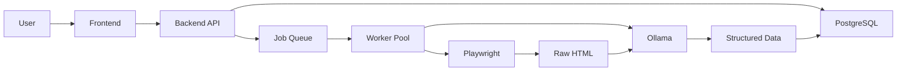

# HoistScraper Quick Fixes

## Current Status

✅ **What's Working:**
- Backend API is running
- Database is operational
- Tenders.gov.au website is added
- Manual trigger endpoint is functional (`/api/scrape/{website_id}/trigger`)

❌ **What's Broken:**
- Worker container keeps restarting (Redis connection issues)
- Scraping fails because Playwright browsers aren't in backend container
- No job enqueueing happening automatically
- No extraction of opportunities from scraped HTML
- No Ollama integration for intelligent data extraction

## Immediate Fix Options

### Option 1: Quick & Dirty (1 hour)
Add Playwright to backend container for testing:

```dockerfile
# In backend/Dockerfile, add after poetry install:
RUN poetry run playwright install chromium --with-deps
```

Then rebuild: `docker-compose build backend`

### Option 2: Fix Worker Container (2 hours)
Fix the Redis connection issues in worker:

1. Update worker Dockerfile to properly wait for Redis
2. Add health checks
3. Fix the connection retry logic

### Option 3: Replace Queue System (4 hours)
Remove Redis/RQ and use simpler approach:

```python
# Use FastAPI BackgroundTasks
from fastapi import BackgroundTasks

@app.post("/api/scrape/{website_id}")
async def trigger_scrape(
    website_id: int, 
    background_tasks: BackgroundTasks,
    session: Session = Depends(db.get_session)
):
    job = create_job(website_id)
    background_tasks.add_task(scrape_and_extract, job.id)
    return job
```

## Testing Current Setup

1. **List websites:**
   ```bash
   curl http://localhost:8000/api/websites
   ```

2. **Create scrape job:**
   ```bash
   curl -X POST http://localhost:8000/api/scrape-jobs \
     -H "Content-Type: application/json" \
     -d '{"website_id": 2}'
   ```

3. **Trigger manual scrape (currently fails):**
   ```bash
   curl -X POST http://localhost:8000/api/scrape/2/trigger
   ```

4. **Check opportunities:**
   ```bash
   curl http://localhost:8000/api/opportunities
   ```

## Production-Ready Architecture



## Next Steps

1. **Add Ollama service** to docker-compose.yml
2. **Fix worker container** or replace queue system
3. **Implement proper extraction pipeline**:
   - Scrape listing page
   - Extract individual tender URLs
   - Scrape each tender detail page
   - Use Ollama to extract structured data
   - Save opportunities to database

4. **Add missing UI pages**:
   - `/opportunities` - View scraped data
   - `/jobs` - Monitor scraping progress

## Critical Missing Pieces

1. **Opportunity Extraction Logic**
   ```python
   # In worker.py, after scraping:
   async def extract_opportunities(html: str, url: str):
       # Parse listing page
       links = extract_tender_links(html)
       
       # Scrape each detail page
       for link in links:
           detail_html = await scrape_page(link)
           
           # Extract with Ollama
           opportunity = await extract_with_ollama(detail_html)
           
           # Save to database
           save_opportunity(opportunity)
   ```

2. **Ollama Integration**
   ```python
   async def extract_with_ollama(html: str) -> dict:
       prompt = """
       Extract tender information:
       - Title
       - Organization
       - Description
       - Deadline
       - Amount
       - Contact
       
       HTML: {html}
       """
       
       response = ollama.generate(
           model="mistral",
           prompt=prompt,
           format="json"
       )
       return json.loads(response)
   ```

3. **Frontend Opportunities Page**
   - Already have API endpoints
   - Just need to build the UI
   - Use existing SWR hooks

## Emergency Workaround

If you need to demo immediately:

1. Manually insert test data:
   ```sql
   INSERT INTO opportunity (
       title, description, source_url, 
       website_id, job_id, deadline
   ) VALUES (
       'Test Grant Opportunity',
       'This is a test opportunity',
       'https://example.com/grant1',
       2, 1, '2024-12-31'
   );
   ```

2. Then view at: `http://localhost:8000/api/opportunities`

## Recommended Action Plan

**For Demo (Today):**
1. Add Playwright to backend container (Option 1)
2. Manually insert some test opportunities
3. Build basic opportunities UI page

**For Production (This Week):**
1. Add Ollama service
2. Fix worker architecture
3. Implement proper extraction pipeline
4. Add authentication for protected sites
5. Deploy to cloud provider