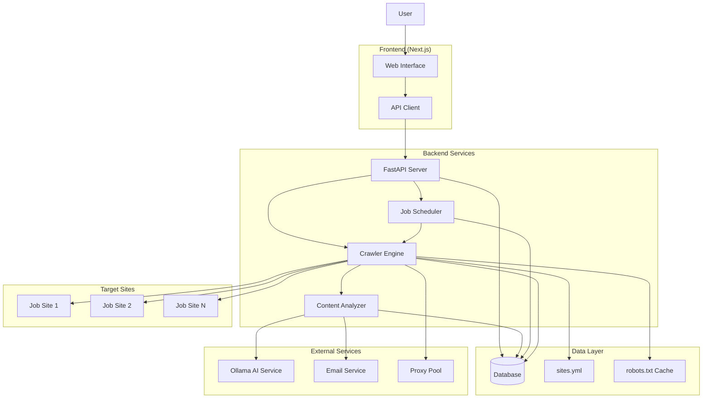
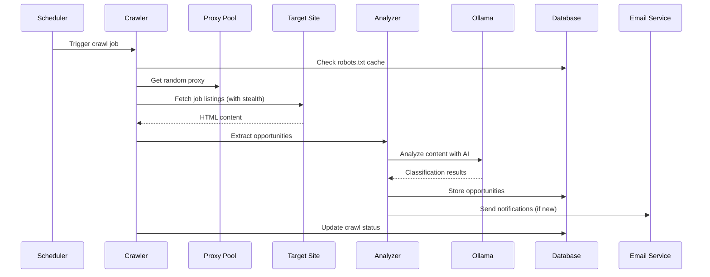
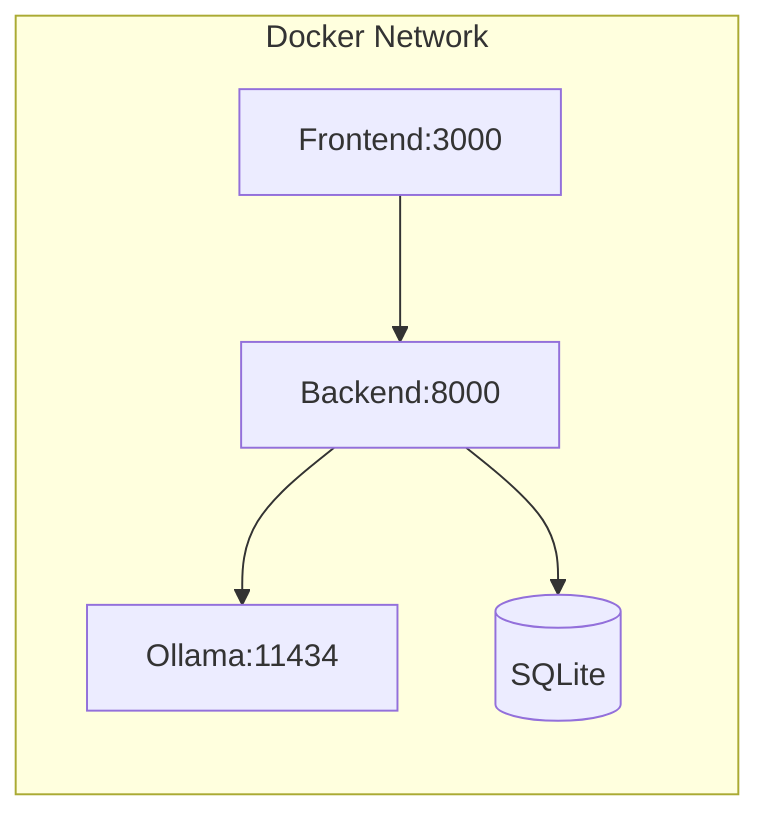
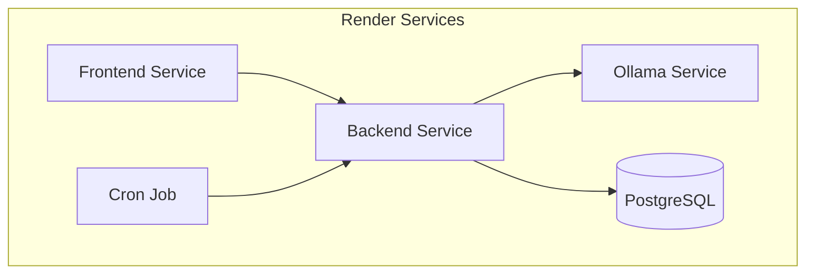

# Architecture Overview

This document describes the architecture and data flow of the HoistScraper application.

## System Architecture

## Data Flow

### 1. Site Configuration
- Sites are configured in `sites.yml` with crawling parameters
- Each site has specific selectors, pagination rules, and crawl limits
- Configuration includes proxy settings and authentication details

### 2. Crawling Process

### 3. Anti-Detection Measures
- **User Agent Rotation**: Random realistic user agents
- **Proxy Rotation**: Distributed requests across proxy pool
- **Stealth Mode**: Playwright stealth to avoid detection
- **Delay Jitter**: Random delays (0.8-2.4s) between actions
- **Headless/Headed Mix**: 10% headed sessions for fingerprint diversity

### 4. Pagination Strategy
1. **Primary**: CSS selector from `sites.yml`
2. **Fallback**: Link text matching `/(next|›)/i`
3. **Stop Conditions**: Repeat URL detection or configured limit

### 5. Content Analysis
- Extract job opportunities using site-specific selectors
- Classify content using Ollama AI service
- Filter based on configured terms and criteria
- Store structured data with metadata

## Component Responsibilities

### Frontend (Next.js)
- **Pages**: Site management, opportunity browsing, dashboard
- **Components**: Reusable UI components with Tailwind CSS
- **State**: SWR for data fetching and caching
- **API Integration**: RESTful API calls to backend

### Backend (FastAPI)
- **API Endpoints**: CRUD operations for sites and opportunities
- **Authentication**: Session-based auth (if implemented)
- **Validation**: Pydantic models for request/response validation
- **Error Handling**: Structured error responses

### Crawler Engine
- **Base Crawler**: Abstract class with common functionality
- **Site Crawlers**: Site-specific implementations
- **Stealth Features**: Anti-detection and proxy support
- **Error Recovery**: Retry logic and graceful degradation

### Content Analyzer
- **Text Extraction**: Clean and structure job posting content
- **AI Classification**: Use Ollama for content analysis
- **Term Filtering**: Apply configured inclusion/exclusion rules
- **Deduplication**: Prevent duplicate opportunity storage

### Job Scheduler
- **Cron Jobs**: Daily crawl execution
- **Queue Management**: Handle multiple site crawls
- **Status Tracking**: Monitor crawl progress and failures
- **Retry Logic**: Automatic retry for failed crawls

## Deployment Architecture

### Docker Compose (Development)

### Render.com (Production)

## Security Considerations

1. **Rate Limiting**: Respect target site limits
2. **Robots.txt Compliance**: Check and honor robots.txt
3. **Legal Compliance**: Analyze terms of service
4. **Data Privacy**: Secure storage of crawled data
5. **Proxy Security**: Secure proxy authentication
6. **Environment Variables**: Sensitive data in env vars

## Scalability

- **Horizontal Scaling**: Multiple crawler instances
- **Database Sharding**: Partition by site or date
- **Caching**: Redis for frequently accessed data
- **CDN**: Static asset delivery
- **Load Balancing**: Distribute API requests

## Monitoring & Observability

- **Health Checks**: Service availability monitoring
- **Metrics**: Crawl success rates, response times
- **Logging**: Structured logging with correlation IDs
- **Alerts**: Email notifications for failures
- **Dashboards**: Real-time status visualization 