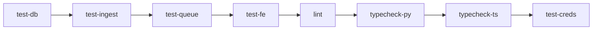

# HoistScraper v0.2 – Master Product Requirements Document (PRD)

## 0. Executive Summary

HoistScraper v0.2 extends the v0.1 baseline with enhanced features for production readiness:

1. **Persistent storage** with full CRUD operations and pagination
2. **Bulk CSV import** with streaming and auto-seeding capabilities  
3. **Background job queue** with Redis/RQ and Playwright workers
4. **React dashboard** with real-time updates and data tables
5. **CI hardening** with strict linting and type checking
6. **Render deployment** with health checks and monitoring
7. **UI polish** with shadcn/ui components and dark mode
8. **Credential management** for authenticated site scraping

The release maintains the principle of isolated, testable features that can be developed and merged independently.

---

## 1. Scope

| **In-Scope**                                          | **Out-of-Scope (v0.2)**                 |
| ----------------------------------------------------- | --------------------------------------- |
| SQLModel schema with relationships                    | Multi-tenant access control             |
| Streaming CSV import with progress tracking           | Advanced analytics/reporting            |
| Redis job queue with retry logic                      | PDF extraction capabilities             |
| React Query data fetching with caching                | Webhook notifications                   |
| TanStack Table with sorting/filtering                 | API rate limiting                       |
| Encrypted credential storage                          | Distributed scraping                    |
| Comprehensive CI pipeline                             | GraphQL API                             |
| Production Render deployment                          | Mobile app                              |

---

## 2. Success Metrics

* **Performance**: 10k site CSV import < 30s, < 500MB memory
* **Reliability**: 99.5% uptime on Render deployment
* **Quality**: ≥90% test coverage, zero type errors, all CI checks green
* **Security**: All credentials encrypted at rest, no plaintext in logs
* **UX**: Page load < 2s, responsive design, accessibility compliant

---

## 3. Engineering Principles

1. **Isolation First**: One branch = one feature = one PR
2. **Sequential Delivery**: Each feature depends only on merged predecessors  
3. **Test-Driven**: Write tests first, maintain ≥90% coverage
4. **Type Safety**: Strict TypeScript and Python typing throughout
5. **Security by Design**: Encryption for sensitive data, principle of least privilege
6. **Observable**: Structured logging, health checks, error tracking

---

## 4. Delivery Blocks

Each block is a surgical task with its own worktree, branch, tests, CI job and PR checklist.

### 🎯 Block A — `feature/bootstrap-db`

| Field              | Value                                                                                                        |
| ------------------ | ------------------------------------------------------------------------------------------------------------ |
| **Goal**           | Persistent storage baseline.                                                                                 |
| **Functional**     | * POST `/api/sites` (idempotent by URL).<br>* GET `/api/sites` with pagination.<br>* GET `/api/sites/{id}`. |
| **Non-Functional** | Duplicate URL ⇒ HTTP 409.<br>Unit-test coverage ≥ 90%.                                                      |
| **CI Job**         | `test-db` – spins Postgres service, runs `tests/test_db.py`.                                                 |
| **PR Checklist**   | Tables auto-create, duplicate guard, pagination working, CI green, CodeRabbit ✅.                             |

### 🎯 Block B — `feature/csv-ingest`

| Field            | Value                                                                                                                           |
| ---------------- | ------------------------------------------------------------------------------------------------------------------------------- |
| **Goal**         | Bulk-load websites; auto-seed DB.                                                                                               |
| **Functional**   | * `/api/ingest/csv` stream processing.<br>* CLI `python -m hoistscraper.cli.import_csv`.<br>* Auto-seed once via `CSV_SEED_PATH`. |
| **Performance**  | Import 10k rows in < 30s, O(memory ≤ 500 MB).                                                                                   |
| **CI Job**       | `test-ingest` – depends `test-db`, runs ingest & seed tests.                                                                    |
| **PR Checklist** | Dedup safe, large CSV memory-safe, seed runs once, CI green.                                                                    |

### 🎯 Block C — `feature/queue-worker`

| Field            | Value                                                                                                    |
| ---------------- | -------------------------------------------------------------------------------------------------------- |
| **Goal**         | Background scraping pipeline.                                                                             |
| **Functional**   | * RQ + Redis queue setup.<br>* Playwright worker with login.<br>* POST `/api/scrape/{site_id}`.<br>* Static `/data` mount. |
| **CI Job**       | `test-queue` – uses `fakeredis`, tests worker state machine.                                             |
| **PR Checklist** | Job status transitions correct, JSON files created, retry logic working, CI green.                        |

### 🎯 Block D — `feature/dashboard-mvp`

| Field          | Value                                                                                                              |
| -------------- | ------------------------------------------------------------------------------------------------------------------ |
| **Goal**       | Basic UI loop.                                                                                                      |
| **Functional** | * Sites page with CSV upload.<br>* Jobs page with status.<br>* Results page with JSON viewer.<br>* React Query hooks. |
| **CI Job**     | `test-fe` – Vitest unit tests + Next.js build verification.                                                         |
| **PR Checklist** | Pages render, CSV upload works, data fetching with loading states, CI green.                                       |

### 🎯 Block E — `feature/ci-hardening`

| Field            | Value                                                                      |
| ---------------- | -------------------------------------------------------------------------- |
| **Goal**         | Static-analysis gate.                                                       |
| **Functional**   | * Ruff with strict config.<br>* mypy --strict.<br>* tsc --noEmit.       |
| **CI Job**       | `lint`, `typecheck-py`, `typecheck-ts` – all required for merge.           |
| **PR Checklist** | All linting/type errors fixed, CI jobs required, no suppressions added.    |

### 🎯 Block F — `feature/render-stack`

| Field            | Value                                                                              |
| ---------------- | ---------------------------------------------------------------------------------- |
| **Goal**         | Live deployment.                                                                    |
| **Functional**   | * render.yaml with all services.<br>* Health checks.<br>* Optional Sentry DSN.  |
| **CI Job**       | N/A – validated via `render validate`.                                             |
| **PR Checklist** | render validate passes, preview environment working, all services green.            |

### 🎯 Block G — `feature/ux-refresh`

| Field            | Value                                                                                                           |
| ---------------- | --------------------------------------------------------------------------------------------------------------- |
| **Goal**         | Polish UI.                                                                                                       |
| **Functional**   | * Tailwind theme tokens.<br>* shadcn/ui components.<br>* Sidebar layout.<br>* TanStack tables.<br>* JSON viewer. |
| **Non-Functional** | Dark mode support, mobile responsive.                                                                           |
| **CI Job**       | Uses existing `test-fe`.                                                                                         |
| **PR Checklist** | New components visible, tables sortable, JSON collapsible, dark mode working.                                   |

### 🎯 Block H — `feature/site-credentials`

| Field            | Value                                                                                              |
| ---------------- | -------------------------------------------------------------------------------------------------- |
| **Goal**         | Support login-required sites.                                                                       |
| **Functional**   | * SiteCredential table with encryption.<br>* PUT `/api/sites/{id}/creds`.<br>* Playwright login helper. |
| **Security**     | Fernet encryption, masked retrieval, no plaintext in logs.                                         |
| **CI Job**       | `test-creds` – tests encryption and login flow.                                                     |
| **PR Checklist** | Credentials encrypted, crawler logs in successfully, CI green.                                      |

---

## 5. CI/CD Overview



* **Required checks for merge:** All jobs green + CodeRabbit review approved
* **Parallel execution:** Where possible to minimize CI time
* **Caching:** Dependencies cached between runs

---

## 6. Merge & Release Process

1. Developer creates feature branch and worktree
2. Implements feature following TDD approach
3. Pushes branch and opens PR
4. Tags **@coderabbit-review** for automated review
5. Fixes issues until CodeRabbit approves and CI is green
6. Comments **`#merge`** to trigger Claude-Merge
7. Bot squash-merges to main and cleans up
8. Render auto-deploys from main branch

---

## 7. Technical Specifications

### 7.1 Database Schema

```python
class Website(SQLModel, table=True):
    id: int = Field(primary_key=True)
    url: str = Field(unique=True, index=True)
    name: str
    description: Optional[str] = None
    created_at: datetime = Field(default_factory=datetime.utcnow)
    
    # Relationships
    jobs: List["ScrapeJob"] = Relationship(back_populates="website")
    credentials: Optional["SiteCredential"] = Relationship(back_populates="website")

class ScrapeJob(SQLModel, table=True):
    id: int = Field(primary_key=True)
    website_id: int = Field(foreign_key="website.id")
    status: str = Field(default="pending")  # pending, in_progress, completed, failed
    started_at: Optional[datetime] = None
    completed_at: Optional[datetime] = None
    result_path: Optional[str] = None
    error_message: Optional[str] = None
    
    # Relationships
    website: Website = Relationship(back_populates="jobs")

class SiteCredential(SQLModel, table=True):
    id: int = Field(primary_key=True)
    website_id: int = Field(foreign_key="website.id", unique=True)
    encrypted_data: str  # Fernet-encrypted JSON
    created_at: datetime = Field(default_factory=datetime.utcnow)
    
    # Relationships
    website: Website = Relationship(back_populates="credentials")
```

### 7.2 API Endpoints

| Method | Path | Description | Response |
|--------|------|-------------|----------|
| GET | `/health` | Health check | `{"status": "healthy"}` |
| GET | `/api/sites` | List sites with pagination | `{"items": [...], "total": n, "page": 1}` |
| POST | `/api/sites` | Create site (idempotent) | `{"id": n, "url": "..."}` or 409 |
| GET | `/api/sites/{id}` | Get site details | Site object with relationships |
| PUT | `/api/sites/{id}/creds` | Save encrypted credentials | `{"status": "saved"}` |
| POST | `/api/ingest/csv` | Upload CSV file | `{"imported": n, "skipped": n}` |
| POST | `/api/scrape/{site_id}` | Trigger scrape job | `{"job_id": n, "status": "pending"}` |
| GET | `/api/jobs` | List jobs with filters | `{"items": [...], "total": n}` |
| GET | `/api/jobs/{id}` | Get job status | Job object with details |
| GET | `/data/{job_id}.json` | Get scrape results | Raw JSON data |

### 7.3 Environment Variables

| Variable | Default | Description | Required |
|----------|---------|-------------|----------|
| `DATABASE_URL` | `postgresql://...` | PostgreSQL connection | Yes |
| `REDIS_URL` | `redis://localhost:6379` | Redis connection | Yes |
| `CSV_SEED_PATH` | `./seed.csv` | Auto-seed file path | No |
| `FERNET_KEY` | - | Encryption key for credentials | Yes |
| `MAX_WORKERS` | `2` | Concurrent Playwright sessions | No |
| `PLAYWRIGHT_TIMEOUT_MS` | `30000` | Page load timeout | No |
| `SENTRY_DSN` | - | Error tracking | No |
| `ALLOWED_ORIGINS` | `*` | CORS origins (space-separated) | No |
| `NEXT_PUBLIC_API_URL` | `http://localhost:8000` | API base URL | Yes |

---

## 8. Security Considerations

1. **Credential Encryption**: All site credentials encrypted with Fernet symmetric encryption
2. **Input Validation**: Pydantic models validate all API inputs
3. **SQL Injection**: SQLModel parameterized queries prevent injection
4. **XSS Prevention**: React automatically escapes content
5. **CORS**: Configurable allowed origins for production
6. **Secrets Management**: Environment variables for sensitive configuration
7. **Logging**: No plaintext credentials in logs, structured logging with levels

---

## 9. Performance Requirements

1. **API Response Time**: < 200ms for simple queries, < 1s for complex operations
2. **CSV Import**: 10k rows in < 30s, streaming to prevent memory issues
3. **Concurrent Scraping**: Support 2-10 parallel Playwright sessions
4. **Frontend Bundle**: < 500KB gzipped, code splitting for routes
5. **Database Queries**: Indexed on common filters, pagination required
6. **Memory Usage**: Worker processes < 512MB, API < 256MB

---

## 10. Future Enhancements (v0.3+)

* **Authentication**: JWT-based auth with role-based access control
* **Webhooks**: Notify external systems on job completion
* **Advanced Selectors**: ML-based content extraction
* **Scheduling**: Cron-based recurring scrape jobs
* **Export Formats**: Excel, JSON, CSV export options
* **Analytics Dashboard**: Scraping success rates, performance metrics
* **Multi-tenancy**: Organization-based data isolation
* **API Rate Limiting**: Protect against abuse
* **Distributed Workers**: Scale scraping horizontally
* **Mobile App**: React Native companion app

---

## 11. Acceptance Criteria

Each feature is considered complete when:

1. All functional requirements are implemented
2. Test coverage exceeds 90% with all tests passing
3. No linting or type errors exist
4. CI pipeline is fully green
5. CodeRabbit review is approved
6. Documentation is updated (if applicable)
7. Feature works in preview environment
8. Performance requirements are met
9. Security requirements are satisfied
10. Merge to main is successful

---

## 12. Risk Mitigation

| Risk | Impact | Mitigation |
|------|--------|------------|
| Playwright memory leaks | High | Worker restart on threshold, monitoring |
| Rate limiting by target sites | Medium | Configurable delays, proxy rotation |
| Large CSV OOM | Medium | Streaming processing, batch inserts |
| Credential exposure | High | Encryption at rest, secure key management |
| CI pipeline slowness | Low | Parallel jobs, dependency caching |
| Render deployment limits | Medium | Optimize builds, use appropriate tiers |

---

*Document Version: 2.0*  
*Last Updated: [Current Date]*  
*Next Review: After v0.2 deployment*