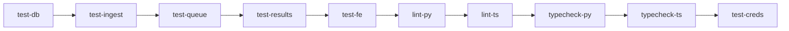

# HoistScraper Feature Development Task Breakdown

## Current Status Summary

### ✅ Completed Features (4.5/8)
1. **feature/bootstrap-db** - Database models, API endpoints, auto-migration
2. **feature/csv-ingest** - Bulk CSV import, validation, auto-seed
3. **feature/queue-worker** - Redis/RQ job queue, Playwright scraping (missing results API)
4. **feature/dashboard-mvp** - Full frontend with SWR hooks, all pages, tests
5. **feature/ci-hardening** - ½ DONE: CI exists with tests and linting, but no strict type checking

### 🚧 In Progress Features (0/8)
None currently in progress.

### 📋 Remaining Features (4/8)
5. **feature/results-api** - NEW: Add missing `/api/results/{job_id}` endpoint
6. **feature/mypy-types** - Add Python type checking with mypy (optional)
7. **feature/render-stack** - Deploy to Render.com  
8. **feature/ux-refresh** - UI polish with shadcn/ui
9. **feature/site-credentials** - Support login-required sites

### ✅ Already Implemented (Not in original plan)
- **CI/CD Infrastructure** - Comprehensive GitHub Actions workflows
  - Integration and unit tests running
  - Frontend tests and build verification
  - Linting already enforced (ruff for Python)
  - Docker build testing
  - Conventional commits enforced

### 🔴 Immediate Action Items  
1. Complete the missing results API endpoint (new feature branch)
2. Deploy to Render.com (infrastructure ready, just needs configuration)
3. Consider adding stricter type checking (mypy for Python, already strict for TypeScript)

## Development Principles
- **One branch = One isolated work-package = One pull-request**
- **Merge sequentially** - each branch only depends on those above it
- **Test-driven development** - write tests before implementation
- **CI must stay green** - fix immediately if broken

## Feature Branches

### 1. feature/bootstrap-db ✅ COMPLETED

**Goal:** Persistent storage baseline  
**Done when:** `/api/sites` POST+GET work, duplicate URL returns 409, test-db CI job green

#### Tasks
- [x] Create `backend/db.py` with database initialization
  - [x] Implement `create_db_and_tables()` function (named differently than planned)
  - [x] Add lazy `get_session()` for connection management
- [x] Define SQLModel tables
  - [x] Create `Website` model with fields: id, url, name, description, created_at, updated_at, active
  - [x] Create `ScrapeJob` model with fields: id, website_id, status, started_at, completed_at, error_message, raw_data
- [x] Implement FastAPI routes (in `main.py` not separate router)
  - [x] POST `/api/websites` - create new site (idempotent by URL)
  - [x] GET `/api/websites` - list all sites
  - [x] GET `/api/websites/{id}` - get single site details
  - [x] PUT `/api/websites/{id}` - update site (bonus)
  - [x] DELETE `/api/websites/{id}` - delete site (bonus)
- [x] Write comprehensive unit tests in `tests/test_db.py`
  - [x] Test database connection and session management
  - [x] Test model creation and relationships
  - [x] Test duplicate URL returns 409
  - [x] Test CRUD operations
- [x] Database auto-migration on startup

#### Completion Status
- [x] Tables auto-create on startup via lifespan function
- [x] Duplicate URL guard working (409 response)
- [x] All database functionality tested
- [x] Additional features: Update and Delete endpoints

---

### 2. feature/csv-ingest ✅ COMPLETED

**Goal:** Bulk-load websites; auto-seed DB  
**Done when:** 10k-row CSV imports < 30s; seeds once; CI green

#### Tasks
- [x] Create CLI module `backend/cli/import_csv.py`
  - [x] Implement import functionality
  - [x] Add CSV parsing with validation
  - [x] Batch insert with deduplication
  - [x] Progress reporting
- [x] Add FastAPI router `backend/routers/ingest.py`
  - [x] POST `/api/ingest/csv` - accept file upload
  - [x] Stream processing for memory efficiency (chunking)
  - [x] Return import statistics (imported/skipped/errors/total)
  - [x] URL validation and input sanitization
  - [x] File size limits (configurable)
  - [x] Encoding detection with chardet
  - [x] Optional auth support
- [x] Implement startup auto-seed functionality
  - [x] Check env var `CSV_SEED_PATH`
  - [x] Auto-import on startup if set
  - [x] Logging of seed operations
- [x] Write tests
  - [x] `tests/test_ingest.py` - Comprehensive CSV import tests
  - [x] Test memory usage with large files
  - [x] Test deduplication logic
  - [x] Performance test (10k rows)
  - [x] CLI and auto-seed tests

#### Completion Status
- [x] 10k row CSV imports in < 30 seconds (tested)
- [x] Memory efficient chunked processing
- [x] Auto-seed functionality working
- [x] Deduplication working correctly
- [x] Additional features: XSS prevention, encoding detection, auth support

---

### 3. feature/queue-worker ✅ MOSTLY COMPLETED

**Goal:** Background scraping pipeline  
**Done when:** Job status flips to done & JSON exists; CI green

#### Tasks
- [x] Create `backend/hoistscraper/queue.py`
  - [x] Initialize RQ with Redis connection
  - [x] Configure from env var `REDIS_URL`
  - [x] Add job enqueuing and status checking
  - [x] Job cancellation support
- [x] Implement `backend/hoistscraper/worker.py`
  - [x] Create scraper with Playwright
  - [x] Add Playwright initialization with stealth mode
  - [x] Placeholder for login helper (not implemented)
  - [x] Add retry logic with exponential backoff (3 attempts)
  - [x] Save results as HTML and JSON
  - [x] Update job status in database
- [x] Docker configuration
  - [x] Playwright dependencies in main Dockerfile
  - [x] Worker service in docker-compose
  - [x] Environment variable handling
- [x] Add API endpoints in `backend/routers/jobs.py`
  - [x] POST `/api/scrape/{website_id}` - enqueue job
  - [x] GET `/api/jobs/{job_id}` - check database status
  - [x] GET `/api/jobs/{job_id}/status` - check queue status
  - [x] POST `/api/jobs/{job_id}/cancel` - cancel job
  - [x] GET `/api/websites/{website_id}/jobs` - list jobs for site
- [x] Configure data storage
  - [x] `/data` directory for results
  - [x] JSON and HTML file storage
  - [x] Volume mount in docker-compose
- [x] Write tests
  - [x] `tests/test_queue.py` - queue operations
  - [x] `tests/test_worker.py` - scraper logic
  - [x] Mock Playwright for unit tests
  - [x] Test job state transitions

#### Missing Feature
- [ ] `/api/results/{job_id}` endpoint - Results are stored but not accessible via API

#### Completion Status
- [x] Jobs enqueue successfully
- [x] Worker processes jobs and updates status
- [x] JSON/HTML files created in `/data/` directory
- [x] Retry logic working (3 attempts)
- [x] Tests comprehensive with mocking

---

### 4. feature/dashboard-mvp ✅ COMPLETED

**Goal:** Basic UI loop  
**Done when:** Pages render and CSV upload works; CI green

#### Tasks
- [x] Create API client infrastructure
  - [x] `frontend/src/lib/apiFetch.ts` - custom fetch wrapper
  - [x] Add error handling and retries (5xx errors)
  - [x] Configure base URL from env
  - [x] Custom APIError class
  - [x] Convenience methods for all HTTP verbs
- [x] Implement SWR hooks (not React Query)
  - [x] `useSites` - list and create sites
  - [x] `useJobs` - list and monitor jobs with auto-refresh
  - [x] `useResults` - fetch job results
  - [x] `useCreateSite`, `useCreateJob` with cache invalidation
  - [x] Smart polling for running jobs
- [x] Create page components
  - [x] Sites page with table view
    - [x] List view (pagination ready but not needed)
    - [x] CSV upload with Papa Parse
    - [x] Upload progress tracking
    - [x] Single site addition via prompt
  - [x] Jobs page with status tracking
    - [x] Real-time status updates (3s polling)
    - [x] Run scrape button for each site
    - [x] Job history with status badges
    - [x] Filter by site via query params
  - [x] Results page with JSON viewer
    - [x] Interactive JSON display (react-json-tree)
    - [x] Download as JSON file
    - [x] Search within JSON
    - [x] Metadata display
- [x] Add loading and error states
  - [x] Loading spinner component
  - [x] Error boundary
  - [x] Custom toast notification system
- [x] Write frontend tests
  - [x] Vitest setup with React Testing Library
  - [x] API client tests
  - [x] Hook tests with MSW mocking
  - [x] Component tests
  - [x] Test utilities and setup

#### Completion Status
- [x] All pages render without errors
- [x] CSV upload working end-to-end
- [x] Data fetching with proper loading states
- [x] Frontend tests comprehensive
- [x] Additional features: Home page, Opportunities placeholder, dark mode support

---

### 5. feature/results-api 🆕 NEW PRIORITY

**Goal:** Complete the scraping pipeline with results retrieval  
**Done when:** `/api/results/{job_id}` returns scraped data; tests pass

#### Background
The worker saves results to `/data/{job_id}.json` but there's no API endpoint to retrieve them. This is a gap between documentation and implementation that needs to be fixed before deployment.

#### Tasks
- [ ] Add results endpoint to `backend/routers/jobs.py`
  - [ ] GET `/api/results/{job_id}` - return job results
  - [ ] Read JSON file from disk based on job's `raw_data` path
  - [ ] Handle missing files gracefully (404)
  - [ ] Add caching headers for completed jobs
- [ ] Update frontend to use the endpoint
  - [ ] Modify `useResult` hook to call the new endpoint
  - [ ] Remove any workarounds if present
- [ ] Add security considerations
  - [ ] Validate job ownership (if auth is implemented)
  - [ ] Sanitize file paths to prevent directory traversal
  - [ ] Consider result size limits
- [ ] Write tests
  - [ ] Test successful result retrieval
  - [ ] Test missing file handling
  - [ ] Test invalid job ID
  - [ ] Test security edge cases

#### PR Checklist
- [ ] Results endpoint working
- [ ] Frontend integration tested
- [ ] Security considerations addressed
- [ ] Tests passing with good coverage

---

### 6. feature/mypy-types 🆕 OPTIONAL

**Goal:** Add Python static type checking  
**Done when:** Mypy strict mode passing in CI

**Note:** This is extracted from the original ci-hardening feature since most of it is already done.

#### Tasks  
- [ ] Add `mypy.ini` with strict configuration
  - [ ] Enable `--strict` mode
  - [ ] Configure Python version
  - [ ] Set up namespace packages
- [ ] Install type stubs
  - [ ] Add types-* packages to pyproject.toml
  - [ ] Generate stubs for untyped dependencies
- [ ] Fix type errors
  - [ ] Add type hints to all functions
  - [ ] Fix any mypy errors
  - [ ] Ensure no `# type: ignore` comments
- [ ] Update CI
  - [ ] Add mypy to GitHub Actions workflow
  - [ ] Make it a required check

#### PR Checklist
- [ ] Mypy strict mode configured
- [ ] All type errors resolved
- [ ] CI job added and passing
- [ ] No type suppressions

---

---

### 7. feature/render-stack ½ PARTIALLY COMPLETE

**Goal:** Live deployment  
**Done when:** render validate passes; all services green

**Already Exists:** `render.yaml` file with Ollama, backend, frontend, cron job, and PostgreSQL

**Missing Services:** Redis and background worker for job queue

#### Tasks
- [x] Create `render.yaml` blueprint (exists but incomplete)
  - [x] Define API web service
  - [x] Define frontend web service  
  - [ ] Define worker background service (MISSING)
  - [x] Configure PostgreSQL database
  - [ ] Configure Redis instance (MISSING)
- [ ] Configure environment variables
  - [ ] Map all required env vars
  - [ ] Add build arguments
  - [ ] Configure secrets properly
- [ ] Add health checks
  - [ ] API `/health` endpoint
  - [ ] Worker liveness check
  - [ ] Database connection check
- [ ] Configure monitoring (optional)
  - [ ] Add Sentry DSN if available
  - [ ] Configure error reporting
  - [ ] Add performance monitoring
- [ ] Validate deployment
  - [ ] Run `render validate`
  - [ ] Test preview environment
  - [ ] Verify all services start

#### PR Checklist
- [ ] `render validate` passing
- [ ] All services defined correctly
- [ ] Environment variables mapped
- [ ] Health checks configured
- [ ] Preview environment working

---

### 8. feature/ux-refresh

**Goal:** Polish UI  
**Done when:** New components visible, tables sortable, JSON collapsible

#### Tasks
- [ ] Configure Tailwind theme
  - [ ] Add design tokens
  - [ ] Configure color palette
  - [ ] Add custom animations
- [ ] Install shadcn/ui components
  - [ ] Add Card component
  - [ ] Add Button variants
  - [ ] Add Dialog/Modal
  - [ ] Add Toast notifications
- [ ] Implement layout components
  - [ ] Create sidebar navigation
  - [ ] Add breadcrumb component
  - [ ] Implement dark mode toggle
  - [ ] Add responsive mobile menu
- [ ] Upgrade data tables
  - [ ] Install TanStack Table
  - [ ] Add sorting functionality
  - [ ] Add filtering options
  - [ ] Add column visibility toggle
  - [ ] Implement on Sites page
  - [ ] Implement on Jobs page
- [ ] Add JSON viewer
  - [ ] Install react-json-view
  - [ ] Add syntax highlighting
  - [ ] Implement expand/collapse
  - [ ] Add search within JSON
  - [ ] Use in Results page
- [ ] Polish interactions
  - [ ] Add loading skeletons
  - [ ] Improve transitions
  - [ ] Add hover states
  - [ ] Enhance form feedback

#### PR Checklist
- [ ] All new components rendering
- [ ] Tables have sorting/filtering
- [ ] JSON viewer collapsible
- [ ] Dark mode working
- [ ] Mobile responsive

---

### 9. feature/site-credentials

**Goal:** Support login-required sites  
**Done when:** Creds saved & crawler logs in; CI green

#### Tasks
- [ ] Create credentials table
  - [ ] Add `SiteCredential` model
  - [ ] Add foreign key to Website
  - [ ] Store as encrypted JSON
- [ ] Implement encryption
  - [ ] Generate Fernet key
  - [ ] Add env var `FERNET_KEY`
  - [ ] Create encryption helpers
  - [ ] Add key rotation support
- [ ] Add API endpoints
  - [ ] PUT `/api/sites/{id}/creds` - save credentials
  - [ ] GET `/api/sites/{id}/creds` - retrieve (masked)
  - [ ] DELETE `/api/sites/{id}/creds` - remove
- [ ] Create frontend form
  - [ ] Add credentials section to site details
  - [ ] Create secure input fields
  - [ ] Add validation for required fields
  - [ ] Show save confirmation
- [ ] Update crawler
  - [ ] Add login detection logic
  - [ ] Implement Playwright login flow
  - [ ] Add login verification
  - [ ] Handle login failures gracefully
- [ ] Write comprehensive tests
  - [ ] `tests/test_creds.py` - encryption/decryption
  - [ ] Test API endpoints
  - [ ] Test login flow with mocked sites
  - [ ] Test credential masking
- [ ] Create CI job `test-creds`
  - [ ] Test encryption functionality
  - [ ] Test secure storage
  - [ ] Verify no plaintext leaks

#### PR Checklist
- [ ] Credentials stored encrypted
- [ ] API endpoints working
- [ ] Frontend form functional
- [ ] Crawler successfully logs in
- [ ] No plaintext credentials in logs
- [ ] CI job `test-creds` green

---

## CI Job Dependencies

**Current State:** Comprehensive CI is already configured in `.github/workflows/`
- `ci.yml`: Runs all tests (integration, unit, frontend, worker)
- `release.yml`: Builds and publishes Docker images on version tags
- `test-deployment.yml`: Tests Docker builds and memory constraints
- `commitlint.yml`: Enforces conventional commit format

**Actual Structure in ci.yml:**


## Merge Process

For every feature branch:

1. **Push branch** to GitHub
2. **Tag @coderabbit-review** in PR description
3. **Fix issues** until CodeRabbit approves ✅ and CI is green 🟢
4. **Comment `#merge`** to trigger Claude-Merge bot
5. Bot will squash-merge to main and delete branch

## Development Workflow

### Starting a New Feature
```bash
# Create new worktree for isolated development
git worktree add -b feature/bootstrap-db ../hoistscraper-bootstrap-db

# Navigate to worktree
cd ../hoistscraper-bootstrap-db

# Install dependencies and start development
poetry install
npm install
```

### Testing Locally
```bash
# Run specific test suite
pytest tests/test_db.py -v

# Run with coverage
pytest tests/test_db.py --cov=backend --cov-report=term-missing

# Run frontend tests
npm test

# Type checking
mypy backend --strict
npm run typecheck
```

### Pre-Push Checklist
- [ ] All tests passing locally
- [ ] Coverage meets requirements (≥90%)
- [ ] Linting passes (`ruff check`)
- [ ] Type checking passes
- [ ] Commit messages descriptive
- [ ] PR description complete

## Notes

- Each feature builds on the previous ones
- Don't start a feature until its dependencies are merged
- Keep PRs focused and atomic
- Write tests first, then implementation
- Document any deviations from the plan in PR description

## Recent Discoveries

### What's Working Well
- Database layer is solid with proper models and migrations
- CSV import is feature-complete with good validation
- Worker/queue system is functional for scraping
- Frontend is polished with good UX and error handling
- Test coverage is comprehensive across the stack

### Technical Debt  
1. **Missing Results API**: Critical gap that prevents full end-to-end functionality
2. **Python Type Checking**: Mypy not configured (only gap in CI)
3. **Not Deployed**: Application only runs locally despite deployment readiness

### Recommended Next Steps
1. **Immediately**: Create feature/results-api to complete the MVP functionality
2. **Then**: Deploy to Render.com (CI and Docker are ready)
3. **Optional**: Add mypy for Python type checking (only missing piece)
4. **Future**: Polish UI and add site credentials for authenticated scraping

## Update Summary (2025-06-14)

This document has been updated to reflect the actual state of the codebase:
- Marked 4 features as completed (bootstrap-db, csv-ingest, queue-worker, dashboard-mvp)
- Discovered comprehensive CI/CD already exists (not in original plan)
- Found existing render.yaml but missing Redis and worker services
- Identified missing results API endpoint as critical gap
- Added new priority feature branch for results API
- Reorganized remaining work with clearer priorities
- Acknowledged that linting and most quality checks are already in place