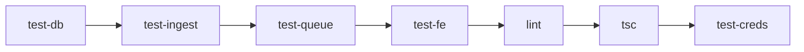

# HoistScraper Feature Development Task Breakdown

## Development Principles
- **One branch = One isolated work-package = One pull-request**
- **Merge sequentially** - each branch only depends on those above it
- **Test-driven development** - write tests before implementation
- **CI must stay green** - fix immediately if broken

## Feature Branches

### 1. feature/bootstrap-db

**Goal:** Persistent storage baseline  
**Done when:** `/api/sites` POST+GET work, duplicate URL returns 409, test-db CI job green

#### Tasks
- [ ] Create `backend/db.py` with database initialization
  - [ ] Implement `init_db()` function
  - [ ] Add lazy `get_session()` for connection management
- [ ] Define SQLModel tables
  - [ ] Create `Website` model with fields: id, url, name, description, created_at
  - [ ] Create `ScrapeJob` model with fields: id, website_id, status, started_at, completed_at, result_path
- [ ] Implement FastAPI routes in `backend/routers/sites.py`
  - [ ] POST `/api/sites` - create new site (idempotent by URL)
  - [ ] GET `/api/sites` - list all sites with pagination
  - [ ] GET `/api/sites/{id}` - get single site details
- [ ] Write comprehensive unit tests in `tests/test_db.py`
  - [ ] Test database connection and session management
  - [ ] Test model creation and relationships
  - [ ] Test duplicate URL returns 409
  - [ ] Test pagination on list endpoint
- [ ] Create GitHub Actions job `test-db`
  - [ ] Add PostgreSQL service container
  - [ ] Run database tests in isolation
  - [ ] Ensure 90%+ test coverage

#### PR Checklist
- [ ] Tables auto-create on startup
- [ ] Duplicate URL guard working (409 response)
- [ ] All tests passing with coverage ≥90%
- [ ] CI job `test-db` green
- [ ] CodeRabbit review approved

---

### 2. feature/csv-ingest

**Goal:** Bulk-load websites; auto-seed DB  
**Done when:** 10k-row CSV imports < 30s; seeds once; CI green

#### Tasks
- [ ] Create CLI module `backend/cli/import_csv.py`
  - [ ] Implement `run(path) -> int` function
  - [ ] Add CSV parsing with validation
  - [ ] Batch insert with deduplication
  - [ ] Progress reporting for large files
- [ ] Add FastAPI router `backend/routers/ingest.py`
  - [ ] POST `/api/ingest/csv` - accept file upload
  - [ ] Stream processing for memory efficiency
  - [ ] Return import statistics (imported/skipped/errors)
- [ ] Implement startup auto-seed functionality
  - [ ] Check env var `CSV_SEED_PATH`
  - [ ] Detect if DB is empty
  - [ ] Run seed once with logging
  - [ ] Mark seed completion in DB
- [ ] Write tests
  - [ ] `tests/test_ingest.py` - CSV import tests
  - [ ] `tests/test_seed.py` - auto-seed tests
  - [ ] Test memory usage with large files
  - [ ] Test deduplication logic
- [ ] Create CI job `test-ingest`
  - [ ] Depends on `test-db`
  - [ ] Test with fixture CSVs of various sizes
  - [ ] Verify performance requirements

#### PR Checklist
- [ ] 10k row CSV imports in < 30 seconds
- [ ] Memory usage stays under 500MB
- [ ] Seed runs once and logs completion
- [ ] Deduplication working correctly
- [ ] CI job `test-ingest` green

---

### 3. feature/queue-worker

**Goal:** Background scraping pipeline  
**Done when:** Job status flips to done & JSON exists; CI green

#### Tasks
- [ ] Create `backend/queue.py`
  - [ ] Initialize RQ with Redis connection
  - [ ] Configure from env var `REDIS_URL`
  - [ ] Add job serialization helpers
- [ ] Implement `backend/worker.py`
  - [ ] Create base scraper class
  - [ ] Add Playwright initialization
  - [ ] Implement login helper for authenticated sites
  - [ ] Add retry logic with exponential backoff
- [ ] Create worker Docker configuration
  - [ ] `Dockerfile.worker` with Playwright deps
  - [ ] `worker_entrypoint.sh` script
  - [ ] Environment variable handling
- [ ] Add API endpoint for job triggering
  - [ ] POST `/api/scrape/{site_id}` - enqueue job
  - [ ] GET `/api/jobs/{job_id}` - check status
  - [ ] Update job status in database
- [ ] Configure static data mount
  - [ ] Create `/data` directory structure
  - [ ] Ensure proper permissions
  - [ ] Add volume mount in docker-compose
- [ ] Write tests
  - [ ] `tests/test_queue.py` - queue operations
  - [ ] `tests/test_worker.py` - scraper logic
  - [ ] Mock Playwright for unit tests
  - [ ] Test job state transitions
- [ ] Create CI job `test-queue`
  - [ ] Use fakeredis for testing
  - [ ] Test worker state machine
  - [ ] Verify JSON output creation

#### PR Checklist
- [ ] Jobs enqueue successfully
- [ ] Worker processes jobs and updates status
- [ ] JSON files created in `/data/{job_id}.json`
- [ ] Retry logic working
- [ ] CI job `test-queue` green

---

### 4. feature/dashboard-mvp

**Goal:** Basic UI loop  
**Done when:** Pages render and CSV upload works; CI green

#### Tasks
- [ ] Create API client infrastructure
  - [ ] `frontend/lib/apiFetch.ts` - base fetch wrapper
  - [ ] Add error handling and retries
  - [ ] Configure base URL from env
- [ ] Implement React Query hooks
  - [ ] `useSites` - list and create sites
  - [ ] `useJobs` - list and monitor jobs
  - [ ] `useResults` - fetch job results
  - [ ] Add optimistic updates
- [ ] Create page components
  - [ ] Sites page with data table
    - [ ] List view with pagination
    - [ ] CSV upload form
    - [ ] Upload progress indicator
  - [ ] Jobs page with status tracking
    - [ ] Real-time status updates
    - [ ] Run scrape button
    - [ ] Job history view
  - [ ] Results page with JSON viewer
    - [ ] Syntax highlighted JSON
    - [ ] Download option
    - [ ] Basic search/filter
- [ ] Add loading and error states
  - [ ] Skeleton loaders
  - [ ] Error boundaries
  - [ ] Toast notifications
- [ ] Write frontend tests
  - [ ] Vitest unit tests for hooks
  - [ ] Component tests with MSW
  - [ ] Build verification test
- [ ] Create CI job `test-fe`
  - [ ] Run vitest tests
  - [ ] Verify Next.js build
  - [ ] Check bundle size

#### PR Checklist
- [ ] All pages render without errors
- [ ] CSV upload working end-to-end
- [ ] Data fetching with proper loading states
- [ ] Frontend tests passing
- [ ] CI job `test-fe` green

---

### 5. feature/ci-hardening

**Goal:** Static-analysis gate  
**Done when:** Merge blocked on any lint/type failure

#### Tasks
- [ ] Configure Python linting
  - [ ] Add `ruff.toml` with strict rules
  - [ ] Configure import sorting
  - [ ] Add docstring requirements
- [ ] Configure Python type checking
  - [ ] Add `mypy.ini` with `--strict` mode
  - [ ] Add type stubs for dependencies
  - [ ] Fix all type errors in codebase
- [ ] Configure TypeScript checking
  - [ ] Update `tsconfig.json` for strict mode
  - [ ] Add `tsc --noEmit` check
  - [ ] Fix all TypeScript errors
- [ ] Update CI workflow
  - [ ] Add `lint` job running ruff
  - [ ] Add `typecheck-py` job running mypy
  - [ ] Add `typecheck-ts` job running tsc
  - [ ] Make all jobs required for merge
- [ ] Fix existing violations
  - [ ] Run all tools locally
  - [ ] Fix violations incrementally
  - [ ] Ensure clean baseline

#### PR Checklist
- [ ] Ruff passing with no violations
- [ ] Mypy strict mode passing
- [ ] TypeScript strict mode passing
- [ ] All CI jobs required for merge
- [ ] No suppressions or ignores added

---

### 6. feature/render-stack

**Goal:** Live deployment  
**Done when:** render validate passes; all services green

#### Tasks
- [ ] Create `render.yaml` blueprint
  - [ ] Define API web service
  - [ ] Define frontend static site
  - [ ] Define worker background service
  - [ ] Configure PostgreSQL database
  - [ ] Configure Redis instance
- [ ] Configure environment variables
  - [ ] Map all required env vars
  - [ ] Add build arguments
  - [ ] Configure secrets properly
- [ ] Add health checks
  - [ ] API `/health` endpoint
  - [ ] Worker liveness check
  - [ ] Database connection check
- [ ] Configure monitoring (optional)
  - [ ] Add Sentry DSN if available
  - [ ] Configure error reporting
  - [ ] Add performance monitoring
- [ ] Validate deployment
  - [ ] Run `render validate`
  - [ ] Test preview environment
  - [ ] Verify all services start

#### PR Checklist
- [ ] `render validate` passing
- [ ] All services defined correctly
- [ ] Environment variables mapped
- [ ] Health checks configured
- [ ] Preview environment working

---

### 7. feature/ux-refresh

**Goal:** Polish UI  
**Done when:** New components visible, tables sortable, JSON collapsible

#### Tasks
- [ ] Configure Tailwind theme
  - [ ] Add design tokens
  - [ ] Configure color palette
  - [ ] Add custom animations
- [ ] Install shadcn/ui components
  - [ ] Add Card component
  - [ ] Add Button variants
  - [ ] Add Dialog/Modal
  - [ ] Add Toast notifications
- [ ] Implement layout components
  - [ ] Create sidebar navigation
  - [ ] Add breadcrumb component
  - [ ] Implement dark mode toggle
  - [ ] Add responsive mobile menu
- [ ] Upgrade data tables
  - [ ] Install TanStack Table
  - [ ] Add sorting functionality
  - [ ] Add filtering options
  - [ ] Add column visibility toggle
  - [ ] Implement on Sites page
  - [ ] Implement on Jobs page
- [ ] Add JSON viewer
  - [ ] Install react-json-view
  - [ ] Add syntax highlighting
  - [ ] Implement expand/collapse
  - [ ] Add search within JSON
  - [ ] Use in Results page
- [ ] Polish interactions
  - [ ] Add loading skeletons
  - [ ] Improve transitions
  - [ ] Add hover states
  - [ ] Enhance form feedback

#### PR Checklist
- [ ] All new components rendering
- [ ] Tables have sorting/filtering
- [ ] JSON viewer collapsible
- [ ] Dark mode working
- [ ] Mobile responsive

---

### 8. feature/site-credentials

**Goal:** Support login-required sites  
**Done when:** Creds saved & crawler logs in; CI green

#### Tasks
- [ ] Create credentials table
  - [ ] Add `SiteCredential` model
  - [ ] Add foreign key to Website
  - [ ] Store as encrypted JSON
- [ ] Implement encryption
  - [ ] Generate Fernet key
  - [ ] Add env var `FERNET_KEY`
  - [ ] Create encryption helpers
  - [ ] Add key rotation support
- [ ] Add API endpoints
  - [ ] PUT `/api/sites/{id}/creds` - save credentials
  - [ ] GET `/api/sites/{id}/creds` - retrieve (masked)
  - [ ] DELETE `/api/sites/{id}/creds` - remove
- [ ] Create frontend form
  - [ ] Add credentials section to site details
  - [ ] Create secure input fields
  - [ ] Add validation for required fields
  - [ ] Show save confirmation
- [ ] Update crawler
  - [ ] Add login detection logic
  - [ ] Implement Playwright login flow
  - [ ] Add login verification
  - [ ] Handle login failures gracefully
- [ ] Write comprehensive tests
  - [ ] `tests/test_creds.py` - encryption/decryption
  - [ ] Test API endpoints
  - [ ] Test login flow with mocked sites
  - [ ] Test credential masking
- [ ] Create CI job `test-creds`
  - [ ] Test encryption functionality
  - [ ] Test secure storage
  - [ ] Verify no plaintext leaks

#### PR Checklist
- [ ] Credentials stored encrypted
- [ ] API endpoints working
- [ ] Frontend form functional
- [ ] Crawler successfully logs in
- [ ] No plaintext credentials in logs
- [ ] CI job `test-creds` green

---

## CI Job Dependencies



## Merge Process

For every feature branch:

1. **Push branch** to GitHub
2. **Tag @coderabbit-review** in PR description
3. **Fix issues** until CodeRabbit approves ✅ and CI is green 🟢
4. **Comment `#merge`** to trigger Claude-Merge bot
5. Bot will squash-merge to main and delete branch

## Development Workflow

### Starting a New Feature
```bash
# Create new worktree for isolated development
git worktree add -b feature/bootstrap-db ../hoistscraper-bootstrap-db

# Navigate to worktree
cd ../hoistscraper-bootstrap-db

# Install dependencies and start development
poetry install
npm install
```

### Testing Locally
```bash
# Run specific test suite
pytest tests/test_db.py -v

# Run with coverage
pytest tests/test_db.py --cov=backend --cov-report=term-missing

# Run frontend tests
npm test

# Type checking
mypy backend --strict
npm run typecheck
```

### Pre-Push Checklist
- [ ] All tests passing locally
- [ ] Coverage meets requirements (≥90%)
- [ ] Linting passes (`ruff check`)
- [ ] Type checking passes
- [ ] Commit messages descriptive
- [ ] PR description complete

## Notes

- Each feature builds on the previous ones
- Don't start a feature until its dependencies are merged
- Keep PRs focused and atomic
- Write tests first, then implementation
- Document any deviations from the plan in PR description